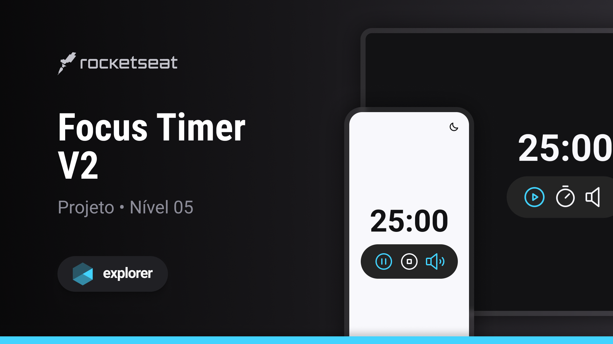

<h1 align="center"> stage 05 Desafio 04  Focus Timer</h1>

  <a href="#-tecnologias">Tecnologias</a>&nbsp;&nbsp;&nbsp;|&nbsp;&nbsp;&nbsp;
  <a href="#-projeto">Projeto</a>&nbsp;&nbsp;&nbsp;|&nbsp;&nbsp;&nbsp;
  <a href="#-layout">Layout</a>&nbsp;&nbsp;&nbsp;|&nbsp;&nbsp;&nbsp;
  <a href="#memo-licença">Licença</a>

  

 
  

   

## 🚀 Tecnologias

Esse projeto foi desenvolvido com as seguintes tecnologias:

- HTML 
- CSS
- Github
- Figma
- JavaScript

## 💻 Projeto

  Esse projeto foi desenvolvido utilizando HTML, CSS e JavaScript, e consiste em um programa interativo em que os usuários digitam a quantidade de minutos desejada para ser usada como um temporizador, assim que se acabam os minutos é emitido um som indicando que o tempo esgotou, o projeto tambem consiste em dois temas, sendo eles o light e o dark.

<h2> Conceitos usados na aplicação</h2>

<ul>
  <li>Estilização de botões e relógio</li>
  <li>Estilos para Light Mode</li>
  <li>Construção do módulo FocusTimer</li>
  <li>Dataset para constrole de ações</li>
  <li>Estruturando o countdown</li>
  <li>finalização da escolha dos minutos do temporizador</li>
  <li>Adicionando sons na aplicação</li>
  <li>Correção do acúmulo de timeout</li>
</ul>
      
 

- [Visite o projeto online](https://iaraMarques.github.io/IMC-Calculator)

 

## 🔖 Layout

Você pode visualizar o layout do projeto através [DESSE LINK](https://www.figma.com/community/file/1263574581735209131). É necessário ter conta no [Figma](https://figma.com) para acessá-lo. 

  

## :memo: Licença

Esse projeto está sob a licença MIT.

---

Feito com ♥ by Iara Marques :wave: [Participe da comunidade da RocketSeat!](https://discord.gg/rocketseat)
